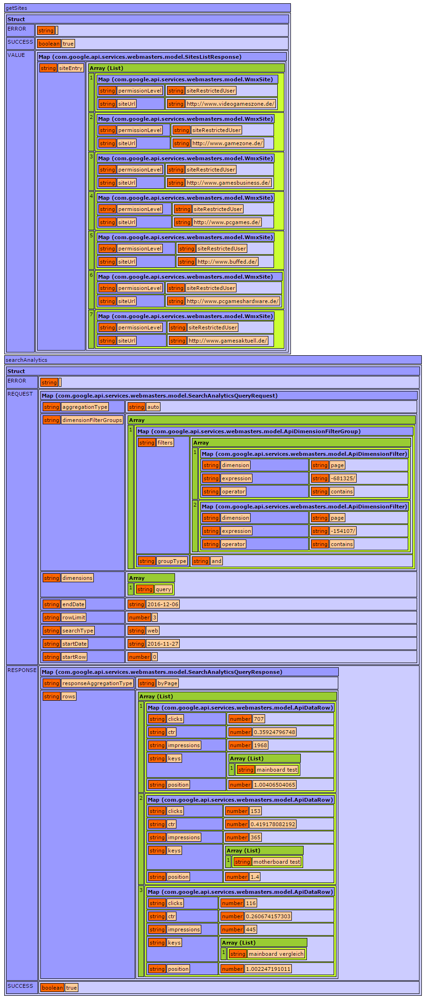

## Google Search Console API for CFML

CFML-Component for accessing the Google Search Console (formerly Webmaster Tools) with a Service Account. Currently implements general authentication, listing of authorized sites and querying search analytics. Accessing Sitemaps, URL Crawl Errors Counts and URL Crawl Errors Samples is not yet implemented, but should be fairly easy to implement based on the current code, if anyone requires it. See https://developers.google.com/webmaster-tools/ for general reference on the Search Console API.

Code has been tested successfully with ColdFusion 8, Lucee 4.5 and Lucee 5 with Google API v3 Library 1.22.0.

## Prerequisites

See https://developers.google.com/webmaster-tools/v3/prereqs for instructions. You'll want to set up a service account, download the JSON-crendentials file for it, save this file somewhere accessible to your application and add this account, using the associated e-mail address, to the properties that need to be accessible via the API. Restricted usage privileges will generally be sufficient for search analytics. You'll need to pass the full physical path in the `keyFile` argument to the `init` method of the component.

You'll also need the [Google Search Console API libraries](https://developers.google.com/webmaster-tools/v3/libraries), off course. Download the ZIP file, unpack it anywhere that is accessible to your application and pass the full physical path to the `webmasters` directory in the `libDir` argument of the `init` method.

As this project uses [Mark Mandels JavaLoader library](https://github.com/markmandel/JavaLoader), you'll need to have this accessible somewhere. You'll need to pass the component path to the `javaLoader` argument of the  `init` method, if it is not `javaloader.JavaLoader`.

## Usage
You'll need to grab an instance of the component using the `init` method; the instance may be held in some higher level scope (i.e. `APPLICATION`). You will however need to call the `buildWebmaster()` method before accessing any of the data retrieving methods - this initiates the authentication flow and as the token ist only valid for an hour, you'll need to make sure, that it's renewed from time to time.

See demo.cfm for an actual usage example. Example output:

## Thanks

Grokking the general request flow, in particular with regards to the usage of a service account for authentication, was made a lot easier by [jensbits CF-GA-service](https://github.com/jensbits/CF-GA-service), so thank you. Also thank you very much Mark Mandel for the JavaLoader library - I really appreciate not having to place each and every project's very own class files in the global class path of each application server _and_ have to restart them for good measure.